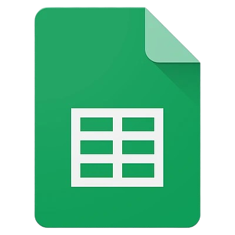

<div align="center">
<a href="https://www.google.com/sheets/about/" target="_blank" rel="noopener noreferrer">
  
</a>
<h2>Sheet CMD</h2>
<p>
  <a href="#rocket-quick-start">Quick Start</a> • <a href="#bulb-usage">Usage</a> • <a href="#package-additional-information">Additional Information</a>
</p>
</div>

## Overview

Manage Google Sheets from the command line: read, write, import/export data across multiple accounts and spreadsheets.

## :sparkles: Features

&nbsp;&nbsp;&nbsp;✔️ **OAuth 2.0 authentication** - secure access without service accounts<br>
&nbsp;&nbsp;&nbsp;✔️ **Multi-account support** - manage personal, work, and other Google accounts<br>
&nbsp;&nbsp;&nbsp;✔️ **Interactive Drive browsing** - select spreadsheets directly from Google Drive<br>
&nbsp;&nbsp;&nbsp;✔️ **Active context system** - set account/spreadsheet/sheet once, use everywhere<br>
&nbsp;&nbsp;&nbsp;✔️ **Data operations** - read, write, append with markdown/CSV/JSON formats<br>
&nbsp;&nbsp;&nbsp;✔️ **LLM-friendly** - designed for AI integrations like Claude Code<br>

## :rocket: Quick Start

```bash
# 1. Install
npm install -g sheet-cmd

# 2. Setup Google OAuth credentials
# → See "Google Cloud Console Setup" section below

# 3. Add your Google account
sheet-cmd account add
# → Follow the setup instructions
# → Paste Client ID and Client Secret
# → Browser opens for authentication
# → Grant permissions

# 4. Add a spreadsheet
sheet-cmd spreadsheet add
# → Browse and select from Google Drive

# 5. Select a sheet
sheet-cmd sheet select
# → Choose sheet to work with

# 6. Start using!
sheet-cmd sheet read
```

<details>
<summary><b>Google Cloud Console Setup</b></summary>

To use sheet-cmd, you need OAuth 2.0 credentials from Google Cloud Console:

**1. Go to [Google Cloud Console](https://console.cloud.google.com/)**

**2. Create or select a project**
- May require setting up billing (free tier available)

**3. Enable APIs**
- Go to "APIs & Services" > "Library"
- Search and enable "Google Sheets API"
- Search and enable "Google Drive API"

**4. Configure OAuth Consent Screen**
- Go to: [OAuth consent screen](https://console.cloud.google.com/apis/credentials/consent)
- User Type: **External**
- App name: sheet-cmd (or any name)
- User support email: your email
- Developer contact: your email
- Click "SAVE AND CONTINUE"

**5. Add Scopes**
- Go to: [Add scopes](https://console.cloud.google.com/auth/scopes)
- Click "ADD OR REMOVE SCOPES"
- Search and add:
  - `.../auth/spreadsheets`
  - `.../auth/drive.readonly`
- Click "UPDATE" then "SAVE AND CONTINUE"

**6. Add Test Users**
- Go to: [Add test users](https://console.cloud.google.com/auth/audience)
- Click "ADD USERS"
- Add your email address
- Click "SAVE AND CONTINUE"

**7. Create OAuth 2.0 Client ID**
- Go to: [Credentials](https://console.cloud.google.com/apis/credentials)
- Click "CREATE CREDENTIALS" > "OAuth client ID"
- Application type: **Desktop app**
- Name: sheet-cmd
- Click "CREATE"
- **Copy the Client ID and Client Secret**

**Note**: The first time you authenticate, you'll see an "unverified app" warning. This is normal for apps in testing mode. Click "Advanced" → "Go to [app name] (unsafe)" to proceed.

</details>

## :bulb: Usage

All commands use the **active account**, **active spreadsheet**, and **active sheet** by default. Set once, use everywhere.

<details>
<summary><b>Account Management</b></summary>

```bash
# Add Google account via OAuth
sheet-cmd account add

# List all accounts (* = active)
sheet-cmd account list

# Select active account (interactive)
sheet-cmd account select

# Remove account (interactive)
sheet-cmd account remove

# Re-authenticate active account
sheet-cmd account reauth
```

</details>

<details>
<summary><b>Spreadsheet Management</b></summary>

```bash
# Add spreadsheet (interactive - browse Google Drive)
sheet-cmd spreadsheet add

# Add spreadsheet manually by ID
sheet-cmd spreadsheet add --id "1ABC..."

# List all spreadsheets (* = active)
sheet-cmd spreadsheet list

# Select active spreadsheet (interactive)
sheet-cmd spreadsheet select

# Select spreadsheet by ID
sheet-cmd spreadsheet select --id "1ABC..."

# Show currently active spreadsheet
sheet-cmd spreadsheet active

# Remove spreadsheet (interactive)
sheet-cmd spreadsheet remove

# Remove spreadsheet by ID
sheet-cmd spreadsheet remove --id "1ABC..."
```

</details>

<details>
<summary><b>Sheet Management</b></summary>

```bash
# List all sheets in spreadsheet
sheet-cmd sheet list

# Select active sheet (interactive)
sheet-cmd sheet select

# Select sheet by name
sheet-cmd sheet select --name "Sheet1"

# Add a new sheet
sheet-cmd sheet add --name "NewSheet"

# Remove a sheet (uses active if --name not provided)
sheet-cmd sheet remove
sheet-cmd sheet remove --name "OldSheet"

# Rename a sheet (uses active if --name not provided)
sheet-cmd sheet rename --new-name "NewName"
sheet-cmd sheet rename --name "OldName" --new-name "NewName"

# Copy a sheet (uses active if --name not provided)
sheet-cmd sheet copy --to "Sheet1 Copy"
sheet-cmd sheet copy --name "Sheet1" --to "Sheet1 Copy"
```

</details>

<details>
<summary><b>Data Operations</b></summary>

```bash
# Read sheet content (uses active sheet if --name not provided)
sheet-cmd sheet read
sheet-cmd sheet read --name "Sheet1"
sheet-cmd sheet read --output csv
sheet-cmd sheet read --formulas
sheet-cmd sheet read --export output.md

# Write to single cell (uses active sheet if --name not provided)
sheet-cmd sheet write --cell A1 --value "Hello"
sheet-cmd sheet write --name "Sheet1" --cell A1 --value "Hello"

# Write to range (uses active sheet if --name not provided)
sheet-cmd sheet write --range A1:B2 --value "v1,v2;v3,v4"
sheet-cmd sheet write --name "Sheet1" --range A1:B2 --value "v1,v2;v3,v4"

# Append row (uses active sheet if --name not provided)
sheet-cmd sheet append --value "col1,col2,col3"
sheet-cmd sheet append --name "Sheet1" --value "col1,col2,col3"
```

**Note**: For `write` command, use `,` to separate columns and `;` to separate rows

</details>

<details>
<summary><b>Import/Export</b></summary>

```bash
# Import CSV (uses active sheet if --name not provided)
sheet-cmd sheet import --file data.csv
sheet-cmd sheet import --name "Sheet1" --file data.csv
sheet-cmd sheet import --file data.csv --skip-header

# Export to JSON (uses active sheet if --name not provided)
sheet-cmd sheet export --format json --output output.json
sheet-cmd sheet export --name "Sheet1" --format json --output output.json

# Export to CSV (uses active sheet if --name not provided)
sheet-cmd sheet export --format csv --output output.csv
sheet-cmd sheet export --name "Sheet1" --format csv --output output.csv

# Export specific range
sheet-cmd sheet export --range B2:I25 --format csv --output output.csv
```

</details>

<details>
<summary><b>System Commands</b></summary>

```bash
# Update to latest version
sheet-cmd update

# Install shell completion (bash/zsh)
sheet-cmd completion install
```

</details>

## :package: Additional Information

**Prerequisites:** Node.js 18+, Google Account, Linux/macOS/Windows

<details>
<summary><b>Configuration Files</b></summary>

Configuration files are stored in:
- **Linux/WSL**: `~/.config/sheet-cmd/`
- **macOS**: `~/Library/Preferences/sheet-cmd/`
- **Windows**: `%APPDATA%/sheet-cmd/`

**Files:**
- `user_metadata.json` - Stores accounts, active selections, and spreadsheets
- `config.json` - Stores general settings

**Example structure:**
```json
{
  "config_path": "~/.config/sheet-cmd/config.json",
  "activeAccount": "user@gmail.com",
  "accounts": {
    "user@gmail.com": {
      "email": "user@gmail.com",
      "oauth": {
        "client_id": "xxx.apps.googleusercontent.com",
        "client_secret": "xxx",
        "refresh_token": "xxx",
        "access_token": "xxx",
        "expiry_date": 1234567890
      },
      "activeSpreadsheet": "my-budget",
      "spreadsheets": {
        "my-budget": {
          "spreadsheet_id": "1ABC...",
          "activeSheet": "monthly"
        }
      }
    }
  }
}
```

**Security**: All OAuth tokens are stored locally and automatically refreshed before expiry.

</details>

<details>
<summary><b>LLM Integration</b></summary>

Sheet CMD is designed to be LLM-friendly, making it easy for AI tools like [Claude Code](https://www.anthropic.com/claude-code) to interact with your Google Sheets data.

**Why this matters:**
- Simple command structure that LLMs can easily understand
- Active context system reduces command complexity
- Clear output formats (markdown, CSV, JSON)
- OAuth 2.0 means no service account credentials to manage
- Multi-account support for different contexts

**Example Claude Code workflow:**
```bash
# Claude can read your budget spreadsheet
sheet-cmd sheet read --name "Budget" --output markdown

# Process the data and write results back
sheet-cmd sheet write --name "Analysis" --cell A1 --value "Summary"

# Export for further analysis
sheet-cmd sheet export --name "Data" --format json --output data.json
```

</details>

<details>
<summary><b>Uninstallation</b></summary>

To completely remove sheet-cmd:

```bash
# 1. Remove shell completions (if installed)
sheet-cmd completion uninstall

# 2. Uninstall the package
npm uninstall -g sheet-cmd

# 3. (Optional) Remove configuration files
# Linux/WSL: rm -rf ~/.config/sheet-cmd/
# macOS: rm -rf ~/Library/Preferences/sheet-cmd/
# Windows: Remove %APPDATA%/sheet-cmd/
```

</details>

<details>
<summary><b>Development setup</b></summary>

For local development:

```bash
# Clone repository
git clone https://github.com/lucasvtiradentes/sheet-cmd.git
cd sheet-cmd

# Install dependencies
npm install

# Build
npm run build

# Run in development
npm run dev -- sheet list

# Run tests
npm run test
npm run test:e2e

# Type checking
npm run typecheck

# Linting
npm run lint
```

</details>

---

<div align="center">
  <p>
    <a target="_blank" href="https://www.linkedin.com/in/lucasvtiradentes/"></a>
    <a target="_blank" href="mailto:lucasvtiradentes@gmail.com"></a>
  </p>
  <p>Made with ❤️ by <b>Lucas Vieira</b></p>
</div>
